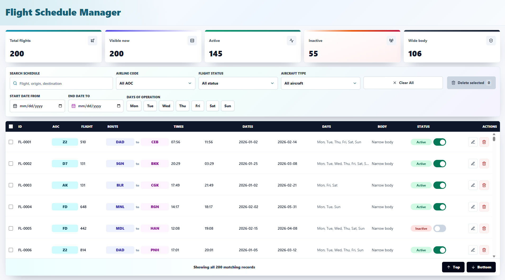
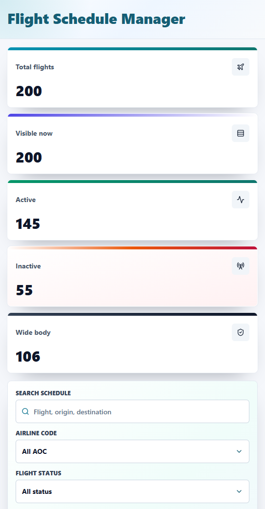

# ✈️ Flight Schedule Manager

A modern, responsive web application for managing flight schedules. View, filter, search, edit, and delete flight records with an intuitive interface optimized for both desktop and mobile devices.

**Live Demo**: Manage operational windows, status changes, schedule edits, and filtered deletion from a virtualized dataset.

---

## 🎯 Features

- **📊 Advanced Filtering & Search**
  - Search by flight ID, origin, or destination
  - Filter by airline code, flight status, aircraft type, and date range
  - Toggle specific days of operation (Mon-Sun)
  - Clear all filters with one click

- **✏️ Inline Editing**
  - Edit departure/arrival times and date ranges directly in the table
  - Real-time validation with error feedback
  - Save or cancel changes on demand

- **🔄 Status Management**
  - Toggle flight status (Active/Inactive) with visual indicators
  - Color-coded status badges (green for active, red for inactive)
  - Status picker dropdown for bulk changes

- **📱 Responsive Design**
  - Desktop table view with full features
  - Mobile card layout with collapsible sections
  - Automatic viewport detection

- **⚡ Performance**
  - Virtual scrolling for 200+ flights without lag
  - Lazy loading with "load more" functionality
  - Optimized re-renders with React.memo

- **📈 Summary Dashboard**
  - Total flights count
  - Visible flights after filtering
  - Active/Inactive flight breakdown
  - Wide-body aircraft count

---

## � Screenshots

### Desktop View
Full-featured table with all filtering and search options


### Mobile View
Responsive card layout for mobile devices


---

### Prerequisites
- Node.js 16+ and npm

### Installation

```bash
# Install dependencies
npm install

# Start development server
npm run dev
```

The app will open at `http://127.0.0.1:5173`

### Building for Production

```bash
# Compile TypeScript and build with Vite
npm run build

# Preview the production build
npm run preview
```

---

## 📁 Project Structure

```
src/
├── main.tsx                          # Application entry point
├── styles.css                        # Global styles
└── modules/flights/
    ├── constants.ts                  # Flight constants
    ├── types.ts                      # TypeScript interfaces
    ├── components/
    │   ├── FlightTable.tsx          # Main table component
    │   ├── FlightToolbar.tsx        # Search & filter toolbar
    │   ├── DropdownSelect.tsx       # Reusable dropdown
    │   ├── StatusBadge.tsx          # Status display
    │   ├── StatusPicker.tsx         # Status selector
    │   ├── ToggleSwitch.tsx         # On/off toggle
    │   ├── IconButton.tsx           # Action buttons
    │   ├── LoadingState.tsx         # Loading indicator
    │   └── SummaryStrip.tsx         # Stats dashboard
    ├── containers/
    │   └── FlightDashboard.tsx      # Main container
    ├── hooks/
    │   └── useFlightSchedule.ts     # Custom hook for flight logic
    ├── services/
    │   ├── flightRepository.ts      # Data access layer
    │   └── saveFlight.ts            # Save operations
    └── utils/
        ├── filterFlights.ts         # Filtering logic
        └── format.ts                # Display formatters
```

---

## 🔧 Available Scripts

| Command | Purpose |
|---------|---------|
| `npm run dev` | Start development server with hot reload |
| `npm run build` | Build for production |
| `npm run preview` | Preview production build locally |
| `npm run lint` | Run ESLint on codebase |
| `npm run extract:data` | Extract flight data from PDF (if available) |

---

## 📊 Data

Flight data is stored in `public/flights.json`. The dataset includes:
- Flight ID, AOC (Airline Operating Code), Flight Number
- Origin/Destination airports
- Departure/Arrival times (STD/STA)
- Schedule date range
- Days of operation (Mon-Sun)
- Aircraft body type
- Flight status (Active/Inactive)

### Data Extraction

If you have a source PDF file (`flights.docx.pdf`), extract the data:

```bash
npm run extract:data
```

This runs the script at `scripts/extract-flights-pdf.cjs` and populates `public/flights.json`.

---

## 🛠️ Tech Stack

| Technology | Purpose |
|-----------|---------|
| **React 18** | UI framework |
| **TypeScript** | Type safety |
| **Vite** | Fast build tool & dev server |
| **Tailwind CSS** | Utility-first styling |
| **React Window** | Virtual scrolling |
| **Lucide React** | Icon library |
| **ESLint** | Code linting |

---

## 🎨 UI Components

### Custom Components
- **FlightTable**: Virtual scrolling table with inline editing
- **FlightToolbar**: Multi-filter search interface
- **SummaryStrip**: Statistics dashboard with flight counts
- **StatusBadge**: Visual status indicator
- **ToggleSwitch**: Active/Inactive toggle
- **DropdownSelect**: Reusable dropdown menu
- **IconButton**: Action buttons with icons

---

## 📱 Responsive Breakpoints

- **Mobile**: < 640px (Card view with side-by-side fields)
- **Tablet**: 640px - 1280px (Card view)
- **Desktop**: 1280px+ (Full table view)

---

## 🚦 Performance Optimizations

- **Virtual Scrolling**: Only renders visible rows (handles 200+ flights smoothly)
- **Memoization**: Components wrapped with `React.memo` to prevent unnecessary re-renders
- **ResizeObserver**: Dynamic table sizing with stable scrollbar gutter
- **Lazy Loading**: "Load More" functionality for large datasets

---

## 📝 License

Private project for internal use.

---

## 👨‍💻 Development Notes

### Adding New Filters
1. Add filter UI to `FlightToolbar.tsx`
2. Implement filter logic in `utils/filterFlights.ts`
3. Update `useFlightSchedule.ts` hook to apply filters

### Modifying Table Columns
1. Update `GRID_COLUMNS` constant in `FlightTable.tsx`
2. Add/remove columns in `FlightRow` component
3. Adjust header checkbox and column headers

### Changing Styling
- Global styles: `src/styles.css`
- Component styles: Tailwind classes in JSX
- Custom colors defined in `tailwind.config.js`

---

Built with ❤️ for efficient flight operations management.
